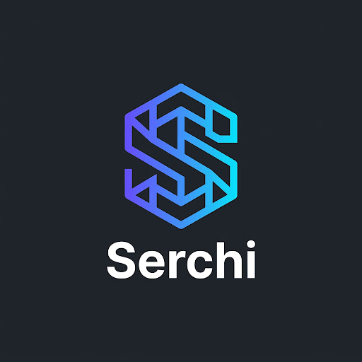

# Serchi — Machine Learning & System Architecture Advisor

<div align="center">
  

  <h3>Intelligent, Privacy-First Local AI Advisor for Machine Learning & Software Systems</h3>

  <p>
    <a href="https://nextjs.org/"></a>
    <a href="https://fastapi.tiangolo.com/"></a>
    <a href="https://huggingface.co/Xen0pp/SmolLM-ML-Planner-500-V3"></a>
    <a href="https://pytorch.org/"></a>
    <a href="https://www.docker.com/"></a>
  </p>
</div>

---

## 📌 Overview

**Serchi** is a specialized, local AI planning assistant tailored for machine learning engineers, data scientists, software architects, and tech leads. It offers real-time guidance on ML project scoping, model architecture selection, dataset preprocessing pipelines, hardware acceleration strategies, MLOps, and general technology queries.

Powered by the fine-tuned Hugging Face model **`Xen0pp/SmolLM-ML-Planner-500-V3`**, Serchi runs **100% locally** on your hardware—ensuring complete data privacy, zero API costs, and full offline functionality.

---

## ✨ Key Features

- 🔒 **Privacy-First Local Inference**: Operates strictly on local hardware using HuggingFace Transformers with Apple Silicon (MPS), NVIDIA CUDA GPU, or CPU fallback. No data leaves your machine.
- ⚡ **Real-Time Streaming**: Asynchronous Server-Sent Events (SSE) streaming from FastAPI → Next.js API Proxy → Client for smooth, real-time token delivery.
- 🎨 **Claude & ChatGPT Inspired UI**: Designed with a dark slate aesthetic (`#202123` / `#343541`), unified message bubble shades, geometric branding, and clean typography.
- 📝 **Markdown & Code Syntax Highlighting**: Full GitHub-Flavored Markdown (GFM) support, structured tables, bullet points, and code blocks with one-click copy buttons.
- 🔄 **Automated Model Lifecycle Tracker**: Real-time frontend status router tracking initial model download (`DownloadScreen`), memory initialization (`LoadingScreen`), and ready state (`ChatWindow`).
- 💾 **Persistent Multi-Session History**: LocalStorage conversation state management, allowing chat history browsing, session switching, and deletion.

---

## 🛠️ Tech Stack

| Domain | Technology | Description |
| :--- | :--- | :--- |
| **Frontend Framework** | Next.js 14 (App Router) | React 18, TypeScript, Server & Client Components |
| **Styling** | Tailwind CSS | Customized slate-gray dark mode palette & responsive layouts |
| **Backend API** | FastAPI / Uvicorn | Python 3.10+, Asynchronous endpoints & SSE Streaming |
| **AI Model & Inference** | PyTorch & HuggingFace | `Xen0pp/SmolLM-ML-Planner-500-V3` (SmolLM2-360M architecture) |
| **Hardware Acceleration** | PyTorch Auto-Device | MPS (Apple Silicon), CUDA (NVIDIA GPU), CPU fallback |
| **Containerization** | Docker & Docker Compose | Multi-container setup for seamless cross-platform execution |

---

## 📁 Project Structure

```
Serchi/
├── start.sh                      # One-click startup script (macOS / Linux)
├── start.bat                     # One-click startup script (Windows)
├── docker-compose.yml            # Multi-container Docker orchestration
├── .gitignore                    # Git exclusion rules
├── README.md                     # Project documentation
├── backend/
│   ├── main.py                   # FastAPI app, SSE streaming & model loader
│   ├── .env                      # Model configuration environment file
│   ├── requirements.txt          # Python dependencies
│   └── Dockerfile                # Backend container build instructions
└── frontend/
    ├── app/
    │   ├── layout.tsx            # Root layout, favicon & metadata
    │   ├── page.tsx              # Main application router & state manager
    │   ├── globals.css           # Tailwind styles & custom animations
    │   └── api/chat/route.ts     # Next.js API route proxy for SSE streaming
    ├── components/
    │   ├── ChatWindow.tsx        # Main chat viewport, header & prompt area
    │   ├── MessageBubble.tsx     # Message rendering, Markdown & syntax highlighter
    │   ├── InputBar.tsx          # Textarea, character counter, send/stop buttons
    │   ├── Sidebar.tsx           # Navigation sidebar, chat history & new chat
    │   ├── DownloadScreen.tsx    # Live model download status UI
    │   └── LoadingScreen.tsx     # Model memory loading status UI
    ├── lib/
    │   └── api.ts                # Stream decoder & backend polling utilities
    ├── public/
    │   └── logo.png              # Geometric 'S' brand logo
    ├── Dockerfile                # Frontend container build instructions
    └── package.json
```

---

## 🚀 Getting Started

### Prerequisites

- **Python**: 3.10 or higher
- **Node.js**: 18.0 or higher
- **Disk Space**: ~1.5 GB (~720 MB for model weights)

---

### Method 1: One-Click Startup Script (Recommended)

#### macOS / Linux
```bash
chmod +x start.sh
./start.sh
```

#### Windows
```cmd
start.bat
```

> **Note**: On the first run, Serchi automatically downloads the model weights (`Xen0pp/SmolLM-ML-Planner-500-V3`) into your HuggingFace cache. The live download progress is rendered directly in the web UI at `http://localhost:3000`.

---

### Method 2: Running with Docker Compose

Ensure Docker and Docker Compose are installed, then run:

```bash
docker-compose up --build
```

Access the application at **`http://localhost:3000`**. Model weights will be persisted across container restarts via Docker volumes (`hf-cache`).

---

### Method 3: Manual Installation

#### 1. Start the Backend Server

```bash
cd backend

# Create virtual environment
python3 -m venv venv
source venv/bin/activate  # On Windows: venv\Scripts\activate

# Install dependencies
pip install -r requirements.txt

# Launch FastAPI server
uvicorn main:app --host 0.0.0.0 --port 8000
```

#### 2. Start the Frontend Application

Open a new terminal window:

```bash
cd frontend

# Install packages
npm install

# Run Next.js development server
npm run dev
```

Visit **`http://localhost:3000`** in your browser.

---

## 🔧 Model & Environment Configuration

You can customize the model or execution environment by editing `backend/.env`:

```env
MODEL_ID=Xen0pp/SmolLM-ML-Planner-500-V3
```

To switch to a different fine-tuned Hugging Face causal language model, update `MODEL_ID` and restart the backend.

---

## 📡 API Reference

The backend provides the following HTTP endpoints on port `8000`:

| Endpoint | Method | Description |
| :--- | :--- | :--- |
| `/health` | `GET` | Returns server health, active execution device (`mps`, `cuda`, `cpu`), and model state |
| `/status` | `GET` | Returns detailed model download & memory loading status |
| `/chat` | `POST` | Accepts `{ prompt, conversation_history }` and streams Server-Sent Events (`text/event-stream`) |

---

## 📄 License

This project is licensed under the MIT License.


